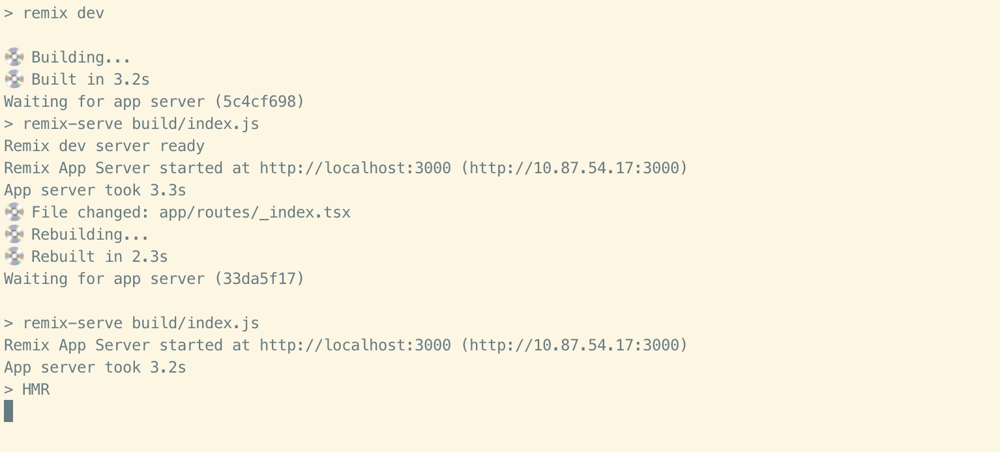

# (re)building takes long time

## Get Start

```bash
$ pnpm install
$ pnpm run dev
```

you can check the `app/root.tsx` file, and uncomment the `ConfigProvider` from `antd`, and try to modify the `root` component trigger the rebuild and hmr.


## Building time campare

### without antd


**190 + 325 = 500ms**

### with antd



**2.3 + 3.2 = 5.5s**
